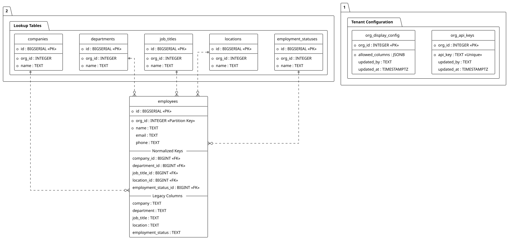

# HR Employee Search Microservice (FastAPI + PostgreSQL)
### Senior Backend Engineer Technical Assignment

A **high-performance, multi-tenant Employee Search Microservice** designed for large HR platforms serving multiple organizations.

Optimized for:
- Searching **millions of employee records**
- Strict **cross-organization data isolation**
- Dynamic, organization-level output configuration (projection)
- Thread-safe, custom-built **rate limiting without external libraries**

Docs:
- Architecture guide: [ARCHITECTURE.md](ARCHITECTURE.md)

## ERD (Database Diagram)



> If the SVG doesn’t render in your viewer, open it directly:
> - [docs/ERD/erd.svg](docs/ERD/erd.svg)
> - Source: [docs/ERD/erd.puml](docs/ERD/erd.puml)

---

## 1) Business Requirements

| Requirement | Description |
|------------|------------|
| Multi-tenant | Each organization can only access its own employees |
| Dynamic fields | Each organization defines which columns are visible |
| High performance | Must handle millions of records |
| Data privacy | No leaking of hidden columns |
| Rate limit | API abuse prevention |
| Scalability | Ready for sharding and read replicas |

---

## 2) Core Features

### 2.1 Optimized Search API
- Filters: `employment_status`, `location`, `company`, `department`, `job_title`
- Partial search on employee name & email (`q`)
- **Keyset pagination** (avoid OFFSET degradation)

### 2.2 Organization-based Dynamic Projection
Each organization has its own `display_config` (in DB table `org_display_config`), e.g.:

| org_id | allowed_columns |
|-------|----------------|
| 1 | id, name, email, job_title |
| 2 | id, name, phone, department |

The system builds `SELECT` dynamically based on this config and prevents data leaks.

### 2.3 Custom Rate Limiter (Standard Library Only)
- Algorithm: Token Bucket
- Thread-safe with `threading.Lock`
- Uses `time.time()` for refill
- Buckets are isolated per org & per IP

### 2.4 Large Dataset Optimization
| Technique | Purpose |
|---------|--------|
| Composite indexes | Fast multi-column filtering |
| Keyset pagination | Stable performance on deep pages |
| Projection | Fetch only needed columns |
| Read replicas | Ready for scaling reads |

---

## 3) Architecture (Clean Architecture)

```
app/
├── api/            # FastAPI routes
├── services/       # Business logic
├── repositories/   # Database access layer (optimized SQL)
├── core/           # Shared components (rate limiter, security, config)
└── models/         # Domain entities
```

---

## 4) API Docs (Swagger)
- Swagger UI: `http://localhost:8000/docs`
- OpenAPI JSON: `http://localhost:8000/openapi.json`
- ReDoc: `http://localhost:8000/redoc`

Swagger supports multiple authorizations:
- `X-API-Key` (OrgApiKey) for tenant usage
- `X-Admin-Key` (AdminApiKey) for admin endpoints and master cross-org access
- `X-Admin-User` (AdminUser) optional for audit (`updated_by`)

---

## 5) Quickstart (Docker)

### Prerequisites
- Docker
- Docker Compose

### Run
```bash
docker-compose up -d --build
```

Health check:
```bash
curl http://localhost:8000/healthz
```

Run tests (inside container):
```bash
docker-compose exec -T api pytest
```

> Note: seed data lives in `scripts/init.sql`. Postgres only runs init scripts on a **fresh** volume.  
> If you changed init scripts and want them re-applied:
```bash
docker-compose down -v
docker-compose up -d --build
```

---

## 6) Auth & Keys

### 6.1 Org API Key (normal tenant access)
Use `X-API-Key: <org-api-key>`

Example seeded keys (may vary by your init/migrations):
- `demo-org-1` → org 1
- `demo-org-2` → org 2

### 6.2 Admin Key (admin endpoints)
Use `X-Admin-Key: <admin-key>`  
Optional: `X-Admin-User: <username>` (stored in audit fields)

### 6.3 Master Key (cross-org access to normal APIs)
Master key is **also** an `X-API-Key`, but it requires **both**:
- `X-API-Key: <MASTER_API_KEY>`
- `X-Admin-Key: <ADMIN_API_KEY>`

Behavior:
- If `org_id` is omitted → defaults to **all orgs**
- If `org_id` is provided → scopes to that org
- If using a normal org key → `org_id` is ignored (still tenant-scoped)

---

## 7) Full cURL Guide (Windows-friendly)

> Base URL: `http://localhost:8000`  
> The examples below use **Windows `cmd.exe`** line-continuation (`^`).  
> If you use PowerShell, remove `^` and use backticks `` ` `` instead.

### 7.1 (Optional) Set convenience variables (cmd.exe)
```bat
set BASE=http://localhost:8000
set ORG_KEY=demo-org-1
set ADMIN_KEY=admin
set ADMIN_USER=interviewer
set MASTER_KEY=master
```

---

### 7.2 Health + OpenAPI
Health:
```bat
curl %BASE%/healthz
```

OpenAPI (useful to verify routes and schemas):
```bat
curl %BASE%/openapi.json
```

Tip: list all routes from OpenAPI (requires Python installed locally):
```bat
curl -s %BASE%/openapi.json | python -c "import json,sys; d=json.load(sys.stdin); print('\n'.join(sorted({f'{m.upper():6} {p}' for p,v in d['paths'].items() for m in v.keys()})))"
```

---

## 7.3 Public (Org-scoped) APIs

### 7.3.1 Search employees
Basic search:
```bat
curl -H "X-API-Key: %ORG_KEY%" ^
  "%BASE%/api/v1/employees/search?limit=10&q=an"
```

Filter example:
```bat
curl -H "X-API-Key: %ORG_KEY%" ^
  "%BASE%/api/v1/employees/search?limit=10&department=Engineering&job_title=Backend"
```

Keyset pagination example (use `after_id` from the last item of the previous page):
```bat
curl -H "X-API-Key: %ORG_KEY%" ^
  "%BASE%/api/v1/employees/search?limit=10&after_id=1000"
```

### 7.3.2 Get employee by id (org-scoped)
```bat
curl -H "X-API-Key: %ORG_KEY%" ^
  "%BASE%/api/v1/employees/123"
```

### 7.3.3 Lookups (org-scoped)
List departments:
```bat
curl -H "X-API-Key: %ORG_KEY%" ^
  "%BASE%/api/v1/lookups/departments?limit=50"
```

List job titles:
```bat
curl -H "X-API-Key: %ORG_KEY%" ^
  "%BASE%/api/v1/lookups/job_titles?limit=50"
```

Get a lookup item by id (public):
```bat
curl -H "X-API-Key: %ORG_KEY%" ^
  "%BASE%/api/v1/lookups/departments/10"
```

---

## 7.4 Master key (cross-org) for Search/Lookups

### 7.4.1 Search across ALL orgs (default when `org_id` omitted)
```bat
curl -H "X-API-Key: %MASTER_KEY%" ^
  -H "X-Admin-Key: %ADMIN_KEY%" ^
  "%BASE%/api/v1/employees/search?limit=10&q=a"
```

### 7.4.2 Search only ONE org
```bat
curl -H "X-API-Key: %MASTER_KEY%" ^
  -H "X-Admin-Key: %ADMIN_KEY%" ^
  "%BASE%/api/v1/employees/search?limit=10&org_id=2"
```

### 7.4.3 Lookups across ALL orgs
```bat
curl -H "X-API-Key: %MASTER_KEY%" ^
  -H "X-Admin-Key: %ADMIN_KEY%" ^
  "%BASE%/api/v1/lookups/departments?limit=50"
```

### 7.4.4 Lookups for ONE org
```bat
curl -H "X-API-Key: %MASTER_KEY%" ^
  -H "X-Admin-Key: %ADMIN_KEY%" ^
  "%BASE%/api/v1/lookups/departments?limit=50&org_id=2"
```

> Note: for “get-by-id” lookup endpoints, master mode may require `org_id` to avoid ambiguity:
```bat
curl -H "X-API-Key: %MASTER_KEY%" ^
  -H "X-Admin-Key: %ADMIN_KEY%" ^
  "%BASE%/api/v1/lookups/departments/10?org_id=2"
```

---

## 7.5 Admin APIs (write operations + configuration)

### 7.5.1 Display config (dynamic allowed columns)
Get config for org:
```bat
curl -H "X-Admin-Key: %ADMIN_KEY%" ^
  "%BASE%/api/v1/admin/orgs/1/display-config"
```

Update config (audit with `X-Admin-User`):
```bat
curl -X PUT ^
  -H "X-Admin-Key: %ADMIN_KEY%" ^
  -H "X-Admin-User: %ADMIN_USER%" ^
  -H "Content-Type: application/json" ^
  -d "{\"allowed_columns\":[\"id\",\"org_id\",\"name\",\"email\",\"department\",\"job_title\"]}" ^
  "%BASE%/api/v1/admin/orgs/1/display-config"
```

Delete config (if supported in your build):
```bat
curl -X DELETE ^
  -H "X-Admin-Key: %ADMIN_KEY%" ^
  "%BASE%/api/v1/admin/orgs/1/display-config"
```

### 7.5.2 API key management (org keys)
Export all org keys (includes a ready-to-copy JSON string):
```bat
curl -H "X-Admin-Key: %ADMIN_KEY%" ^
  "%BASE%/api/v1/admin/api-keys"
```

Get current key for an org:
```bat
curl -H "X-Admin-Key: %ADMIN_KEY%" ^
  "%BASE%/api/v1/admin/orgs/1/api-key"
```

Rotate/set an org API key:
```bat
curl -X PUT ^
  -H "X-Admin-Key: %ADMIN_KEY%" ^
  -H "X-Admin-User: %ADMIN_USER%" ^
  -H "Content-Type: application/json" ^
  -d "{\"api_key\":\"org1-new-key\"}" ^
  "%BASE%/api/v1/admin/orgs/1/api-key"
```

Delete an org API key (if supported in your build):
```bat
curl -X DELETE ^
  -H "X-Admin-Key: %ADMIN_KEY%" ^
  "%BASE%/api/v1/admin/orgs/1/api-key"
```

---

## 7.6 Admin CRUD (Employees + Lookup entities)

> Endpoints below assume your admin CRUD is scoped under:
> - Employees: `/api/v1/admin/orgs/{org_id}/employees`
> - Lookups: `/api/v1/admin/orgs/{org_id}/lookups/{kind}`
>
> If your repo uses different paths, copy the exact paths from `%BASE%/openapi.json`.

### 7.6.1 Employees (admin CRUD)
Create employee (example payload; adjust fields to your schema):
```bat
curl -X POST ^
  -H "X-Admin-Key: %ADMIN_KEY%" ^
  -H "X-Admin-User: %ADMIN_USER%" ^
  -H "Content-Type: application/json" ^
  -d "{\"name\":\"Alice Nguyen\",\"email\":\"alice@example.com\",\"phone\":\"0900000000\",\"department\":\"Engineering\",\"job_title\":\"Backend\"}" ^
  "%BASE%/api/v1/admin/orgs/1/employees"
```

List employees (admin, keyset pagination):
```bat
curl -H "X-Admin-Key: %ADMIN_KEY%" ^
  "%BASE%/api/v1/admin/orgs/1/employees?limit=10"
```

Get employee by id (admin):
```bat
curl -H "X-Admin-Key: %ADMIN_KEY%" ^
  "%BASE%/api/v1/admin/orgs/1/employees/123"
```

Patch employee:
```bat
curl -X PATCH ^
  -H "X-Admin-Key: %ADMIN_KEY%" ^
  -H "X-Admin-User: %ADMIN_USER%" ^
  -H "Content-Type: application/json" ^
  -d "{\"phone\":\"0911111111\"}" ^
  "%BASE%/api/v1/admin/orgs/1/employees/123"
```

Delete employee:
```bat
curl -X DELETE ^
  -H "X-Admin-Key: %ADMIN_KEY%" ^
  "%BASE%/api/v1/admin/orgs/1/employees/123"
```

### 7.6.2 Lookup entities (admin CRUD)
Supported kinds:
- `companies`
- `departments`
- `job_titles`
- `locations`
- `employment_statuses`

Create a department:
```bat
curl -X POST ^
  -H "X-Admin-Key: %ADMIN_KEY%" ^
  -H "X-Admin-User: %ADMIN_USER%" ^
  -H "Content-Type: application/json" ^
  -d "{\"name\":\"Platform\"}" ^
  "%BASE%/api/v1/admin/orgs/1/lookups/departments"
```

List departments:
```bat
curl -H "X-Admin-Key: %ADMIN_KEY%" ^
  "%BASE%/api/v1/admin/orgs/1/lookups/departments?limit=50"
```

Get department by id:
```bat
curl -H "X-Admin-Key: %ADMIN_KEY%" ^
  "%BASE%/api/v1/admin/orgs/1/lookups/departments/10"
```

Update department:
```bat
curl -X PUT ^
  -H "X-Admin-Key: %ADMIN_KEY%" ^
  -H "X-Admin-User: %ADMIN_USER%" ^
  -H "Content-Type: application/json" ^
  -d "{\"name\":\"Platform Engineering\"}" ^
  "%BASE%/api/v1/admin/orgs/1/lookups/departments/10"
```

Delete department:
```bat
curl -X DELETE ^
  -H "X-Admin-Key: %ADMIN_KEY%" ^
  "%BASE%/api/v1/admin/orgs/1/lookups/departments/10"
```

---

## 8) Configuration Notes

- Allowed columns:
  - If `ORG_ALLOWED_COLUMNS_JSON` is provided → uses it
  - Otherwise → loads from Postgres table `org_display_config`
- Admin endpoints use `X-Admin-Key` (required) and support `X-Admin-User` (optional) for audit fields (`updated_by`).
- Master cross-org access uses `MASTER_API_KEY` and requires `X-Admin-Key` too.

---

## 9) Technology Stack
- Python 3.11
- FastAPI
- PostgreSQL
- Docker / Docker Compose
- Pytest